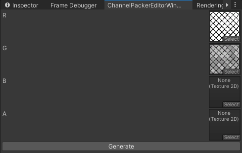

# Tech Art Portfolio
>Project uses Universal Render Pipeline

## Blinn Phong shader
### Features
- Albedo: Color and Texture
- Texture: Tilling and Offset
- Diffuse
- Specular

## Blinn Phong shader with texture rotation
### Features
- Albedo: Color and Texture
- Texture: Tilling/Offset and rotation round center
- Diffuse
- Specular

## Bling Phong With Shadows and Transparency
### Features in addition to default Blinn Phong shader:
- Shadows (receive and cast)
- Transparency (blend + cutout)
- Front, Back, Double sided rendering modes

## PBR
### Features:
- Albedo, Normal, Metallic, Smoothness, Specular, Emission maps are supported
- Parallax mapping
- Specular/Metallic setup workflow
- Texture Channel Packing

## Channel Packer Editor
### Feature:
- Packs several masks(up to 4) into one RGBA mask.

Example: Metallic and Smoothness masks are packed into one mask

## Toon Shader
### Features
- Albedo: Color and Texture (configurable shadow color and intensity)
- Texture: Tilling and Offset
- Diffuse (configurable smoothness and threshold)
- Specular (configurable smoothness and threshold)

## CircleOfNthPower
### Features
- Plots the [squircle](https://en.wikipedia.org/wiki/Squircle) with the particular power. 

## Instancing
### Features
- Rendering 1000 cubes with random rotation, scale and color using instancing.

DrawCalls:

## Smoke With Distortion
### Features:
- Distortion uses opaque texture

## Triplanar Mapping
### Features:
- Albedo blending 
- Normal map blending (UDN)
- Configurable blend sharpness
- Normal strength (per texture) 

## Triplanar Grass Effect (Shader Graph)
### Features:
- Normal direction-based blending between rock and grass textures
- Configurable threshold and smoothness of the rock to grass transition

## Outline
### Features:
- Implemented as URP Render Feature
- Sobel filter for color, depth and normals

